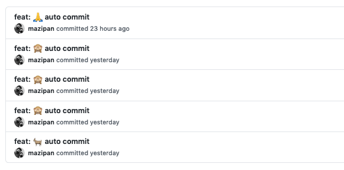

# brrrcommits
🌳 Making your Github stats green, powered by [Github Actions](https://github.com/features/actions)
Auto-commit small changes to pile up those commit stats

## Make it your own
- Create your own repo by clicking "**Use this template**" button (**a forked repo will not work**!)

Or do it the manual way:

- Create your own repo
- Copy both files `.github/workflows/autocommit.yml` and `LAST_UPDATED` to your repo
- Change the `email` and `name` information listed in file [autocommit.yml, line 29 and 30](https://github.com/nottherealtar/brrrcommits/tree/master/.github/workflows/autocommit.yml#L29)
- Change the scheduling time on file [autocommit.yml, line 10](https://github.com/nottherealtar/brrrcommits/tree/master/.github/workflows/autocommit.yml#L10). You can use [crontab.guru](https://crontab.guru/) if   you are unfamiliar with the cron schedule string. For the first time, you can try to run it every hour with string `1 * * * *`

## Credits
- [Github Actions](https://github.com/features/actions)
- [ad-m/github-push-action](https://github.com/ad-m/github-push-action)
- [Github Template](https://github.com/mazipan/auto-commit.git)

## Consider Supporting me

- [My Linktree](https://bit.ly/nottherealtar)
- [My Discord Server](https://bit.ly/3smqFxK)
- [My Twitch](https://bit.ly/tarstwitch)

---

© 2023 made by nottherealtar

